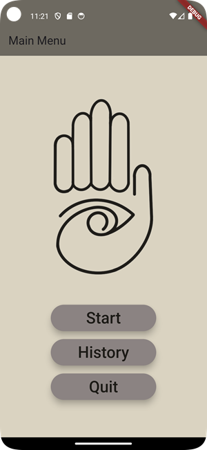
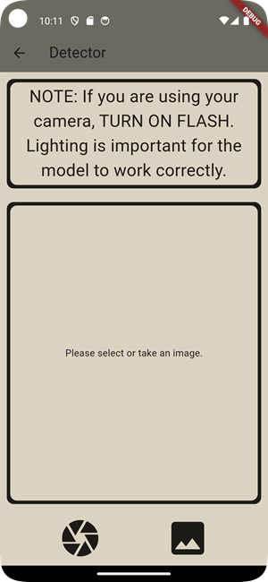
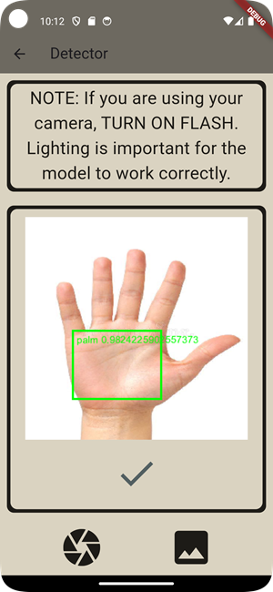

# PalmPaths_v1

An initial implementation of the PalmPaths project. A simpler approach and design centered around functionality rather than user experience.

The palm line extraction was done largely done in an original method but was also inspired by this paper:
A. Bruno, P. Carminetti, V. Gentile, M. La Cascia and E. Mancino, "Palmprint principal lines extraction," 2014 IEEE Workshop on Biometric Measurements and Systems for Security and Medical Applications (BIOMS) Proceedings, Rome, Italy, 2014, pp. 50-56, doi: 10.1109/BIOMS.2014.6951535.
keywords: {Feature extraction;Filtering;Gray-scale;Noise;Accuracy;Detectors;Data mining;Palmprint;Palm line extraction;segmentation;biometric},

## Requirements

This project requires the following to run on AndroidStudio:

- flutter SDK : >=3.3.1 <4.0.0
- AndroidStudio
- Android SDK

## Usage

There are two ways you can run this project. You can either clone it to AndroidStudio or install the APK to an android device/emulator.

#### Android

- A released APK will be available once the project is deemed 'Complete'.

#### Cloning

- Ensure you have the requirements to run this project in the #Requirements section.
- Clone the project to a workspace in AndroidStudio using 'git clone https://github.com/aoroudjev/PalmPaths_v1.git'.
- Use 'flutter pub get' to install the dependencies.

Once installed...

- Open the App to the main menu:

- Press start to go to the Detection menu:

- Using the icon buttons at the bottom, either take a picture with your camera or upload and existing image. The app will run detection on the image to find a palm. If a palm is found, it will be boxed with a green square. If a palm is not found the app will assume the whole image is the palm for the next steps.

- Press the now visible confirm check mark.
- This will take you to the final results screen where the inference will be done on the palm/image given.

[//]: # (TODO: Finish)
